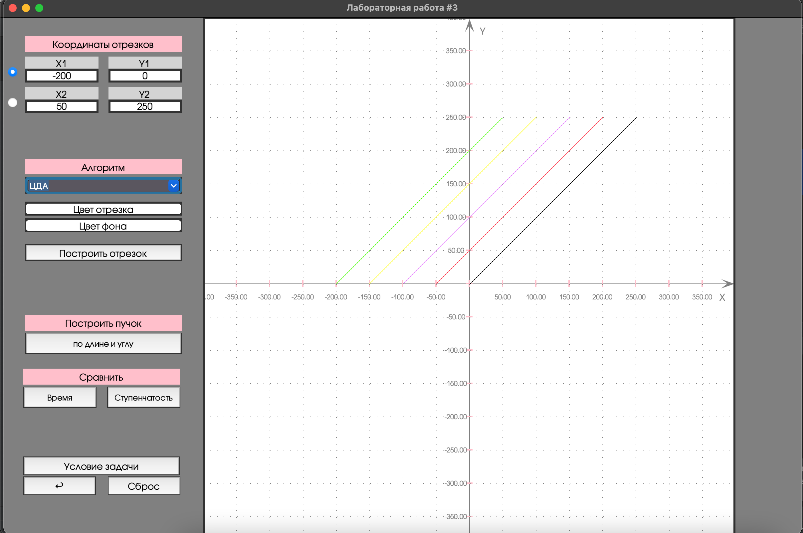

# Лабораторная 3. Вариант 4.
## Геометрические преобразования  

### Условие задачи
Реализовать возможность построения отрезков методами Брезенхема, Ву, ЦДА, построение пучка отрезков и сравнение времени и ступенчатости.
