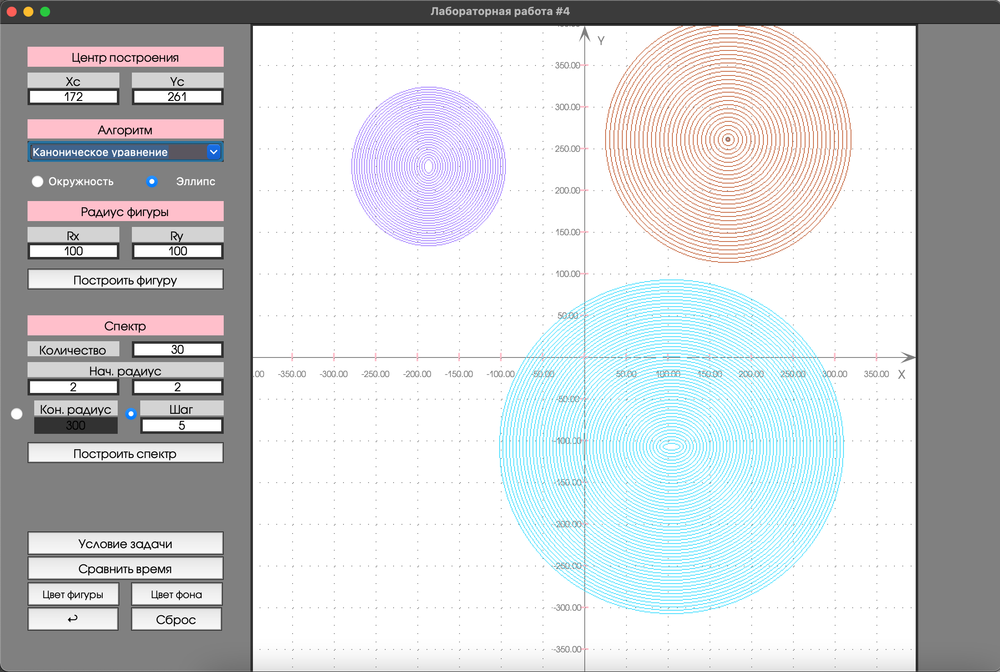

# Лабораторная 4. Вариант 4.
## Реализация и исследование алгоритмов генерации окружности и эллипса    

### Условие задачи
Реализация алгоритмов построения окружности, исследование и сравнение визуальных и временных характеристик алгоритмов.
