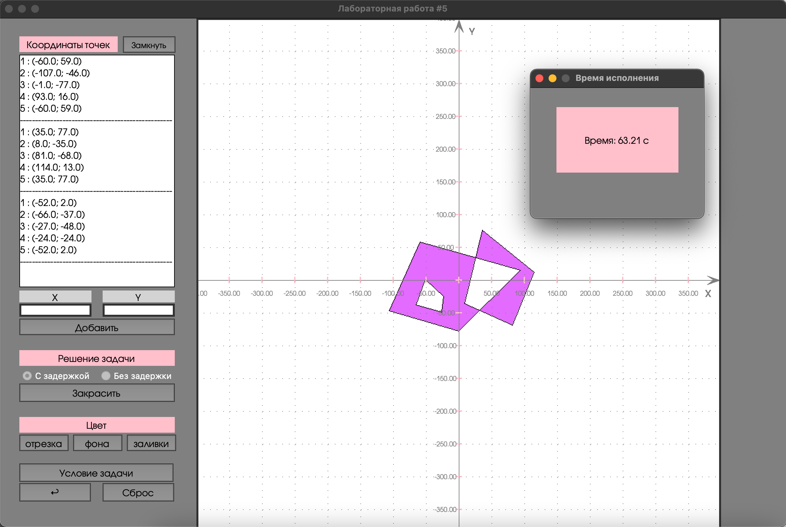

# Лабораторная 5. Вариант 4.
## Реализация и исследование одного из алгоритмов растрового заполнения области  

### Условие задачи
Алгоритмы растрового заполнения сплошных областей. Алгоритм заполнения со списком ребер и флагом.  
