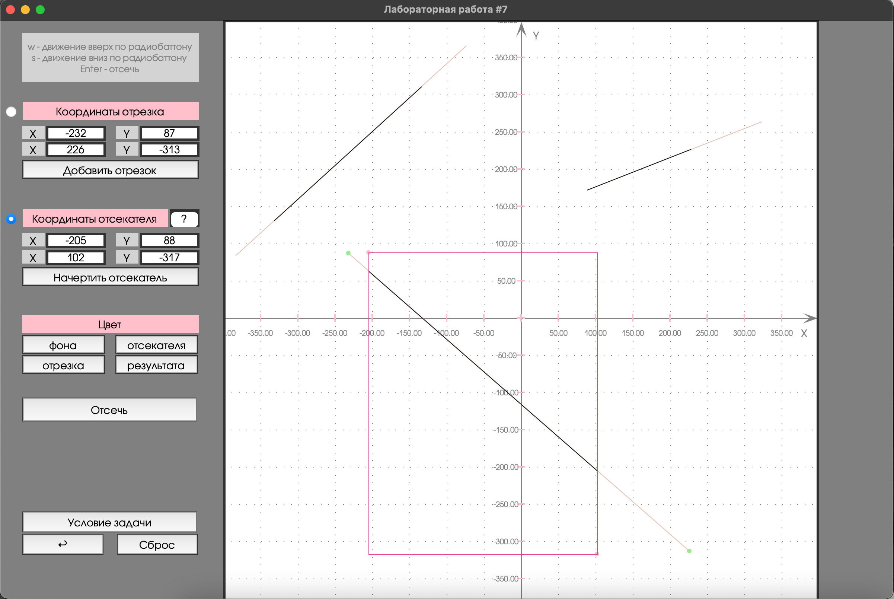

# Лабораторная 7. Вариант 4.
## Изучение и программная реализация алгоритма отсечения отрезка  

### Условие задачи
Реализация (и исследование) отсечения отрезка регулярным отсекателем методом Сазерленда-Коэна  
