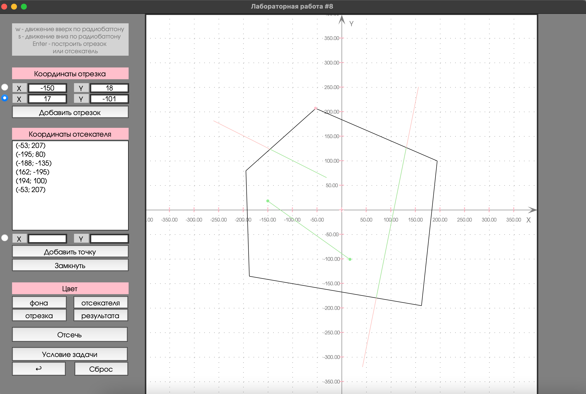

# Лабораторная 8. Вариант 4.
## Изучение и программная реализация  алгоритма отсечения отрезка  

### Условие задачи
Реализация (и исследование) отсечения отрезка нерегулярным отсекателем методом Кируса-Бека  
