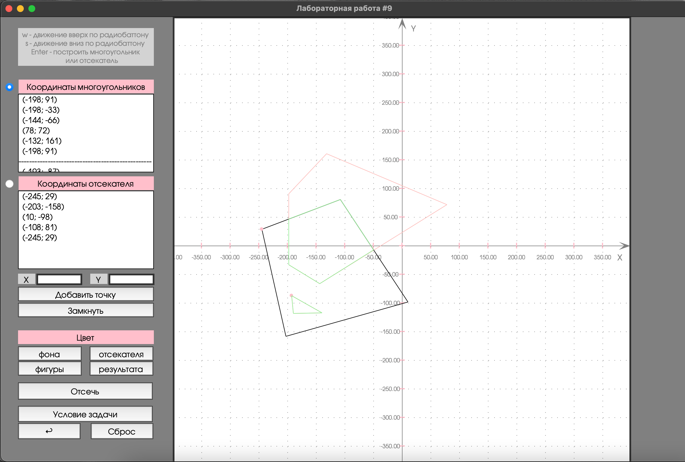

# Лабораторная 9. Вариант 4.
## Изучение и программная реализация алгоритма Сазерленда-Ходжмена отсечения многоугольников  

### Условие задачи
Реализация (и исследование) отсечения многоугольника нерегулярным отсекателем методом Сазерленда-Ходжмена  
